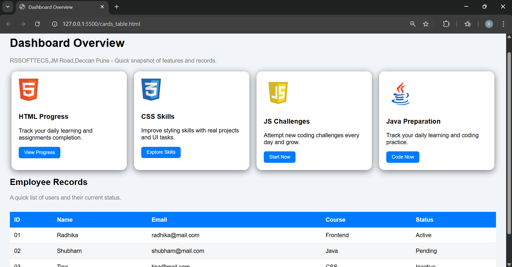

# dashboard-project
Dashboard Overview

This project is a responsive dashboard webpage created as part of my internship at RSSOFTTECS, JM Road, Deccan, Pune.
It displays learning progress cards and a dynamic employee records table.

🚀 Features
✔️ Learning Progress Cards

HTML Progress

CSS Skills

JavaScript Challenges

Java Preparation
Each card includes an image, description, and button.

✔️ Employee Records Table

Displays user details

Status such as Active / Pending / Inactive

Hover highlight effect

Alternating row colors

✔️ Responsive Layout

Cards adjust layout based on screen size

Mobile-friendly design

🖼️ Screenshots

🛠️ Technologies Used
Technology	Purpose
HTML5	Structure of the dashboard
CSS3	Styling, layout, responsiveness
Images	Icons for each card

📁 Project Structure
dashboard-project/
│── index.html
│── style.css
│── html_img.png
│── css_img.jpg
│── js_img.png
│── java_img.png
│── README.md

📜 HTML Preview (Main Sections)
1. Cards Section

Displays 4 progress cards

Each card contains:

Image

Title

Description

Button

2. Employee Records Table

ID, Name, Email, Course, Status

Stripe effect and hover effect

🎨 CSS Highlights
Card Styling

Box-shadow

Hover zoom effect

Rounded corners

Table Styling

Blue headers

Striped rows

Hover background change

Responsive Design

Cards wrap on mobile

Smooth flexible grid

▶️ How to Run the Project
Method 1: Open in Browser

Download project as ZIP

Extract it

Open cards_table.html or your main HTML file

Ensure all image files are in the same folder

Method 2: GitHub Pages Hosting

Go to Settings

Scroll to Pages

Select branch → main

Save

Your dashboard will be live as a website

👩‍💻 Author

Radhika Vasant Wakte
Frontend & Full-Stack Java Trainee
RSSOFTTECS Pune
